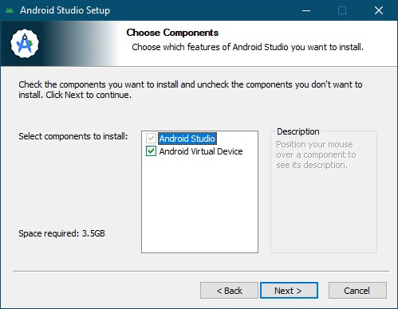

# Инструкция по установке и настройке Android Studio в изолированной сети
## Оглавление
- [Инструкция по установке и настройке Android Studio в изолированной сети](#инструкция-по-установке-и-настройке-android-studio-в-изолированной-сети)
    - [Требования для успешной настройки](#требования-для-успешной-настройки)
    - [Настройки Nexus Repository](#настройки-nexus-repository)
    - [Подготовка к развертыванию](#подготовка-к-развертыванию)
    - [Настройка скриптов](#настройка-скриптов)
    - [Настройка рабочих мест](#настройка-рабочих-мест)
      - [Порядок действий](#порядок-действий)
___
Для организации работы будет использоваться [Nexus Repository](https://help.sonatype.com/en/download.html#related-links) с проксированием Maven репозиториев.  
### Требования для успешной настройки
1. Скачать последнюю версию Gradle (_**Binary-only**_): [Download](https://gradle.org/releases)
2. Скачать последнюю версию Android Studio: [Download](https://developer.android.com/studio)
3. Скачать Java JDK: [Download](https://adoptium.net)
4. Скачать KeyStore Explorer: [Download](https://keystore-explorer.org/downloads.html)
___
### Настройки Nexus Repository
В Nexus Repository необходимо добавить следующее репозитории:

|Name|Remote storage|Type|Member repositories|
|:-|:-|:-|:-|
|fabric|https://maven.fabric.io/public/|maven2 (proxy)|
|google|https://dl.google.com/dl/android/maven2/|maven2 (proxy)|
|gradle-plugin|https://plugins.gradle.org/m2/|maven2 (proxy)|
|jcenter|https://jcenter.bintray.com/|maven2 (proxy)|
|maven-apache|https://repo.maven.apache.org/maven2/|maven2 (proxy)|
|maven-central|https://repo1.maven.org/maven2/|maven2 (proxy)|
|maven-public||maven2 (group)|fabric, google, gradle-plugin, jcenter, maven-apache, maven-central|

Для подключения Nexus Repository используйте адрес maven-public.
___
### Подготовка к развертыванию
Для подготовки файлов понадобится компьютер с полным доступом в интернет.

Устанавливаем Android Studio с настройками по умолчанию и запускаем.

More Actions -> SDK Manager ->  SDK Platforms

Отмечаем нужные вам версии SDK или выбираем последнюю.

More Actions -> SDK Manager ->  SDK Tools

Отмечаем следующие пункты:

* Android SDK Build-Tools
* Android Emulator
* Android Emulator hypervisor driver
* Android SDK Platform-Tools
* Intel x86 Emulator Accelerator (для процессоров Intel)

Примените изменения и установите требуемые компоненты.

More Actions -> SDK Manager ->  Virtual Device Manager

Создайте виртуальное устройство.

___
### Настройка скриптов
Gradle - программа для сборки проектов (и не только). По умолчанию Android Studio располагает его в %USERNAME%\\.gradle. Сделаем этот каталог общим для всех пользователей с помощью системных переменных.

Для работы виртуальных устройств Android Studio создает каталог %USERNAME%\\.android. В нем содержатся настройки для созданных виртуальных устройств.

Так же файлы и настройки SDK распаложены в %LOCALAPPDATA%\Android\Sdk

По умолчанию, Android Studio создает .android и Sdk для каждого пользователя. Мы сделаем эти каталоги общими, чтобы их могли использовать все пользователи рабочего места с помощью системных переменных.

.android и Sdk будут необходимы для дальнейшей настройки рабочих мест. 

Для автоматизированной записи переменных будем использовать утилиту setenv.exe

[RunAsAdmin]AddVariablesAndCopyFiles.cmd - скрипт для автоматического копирования .android, Sdk, Gradle и скриптов инициализации init.d на рабочее место и записи переменных в систему. 

По умолчанию скрипт создает папку C:\AndroidSettings и копирует в нее необходимые файлы. Перед запуском скрипта, измените каталог если это необходимо. 

Скрипт необходимо запустить с **правами администратора**.

Для добавления локального Nexus Repository в качестве репозитория артефактов в Android Studio используются скрипты инициализации в каталоге init.d:
* init.gradle (для Groovy DSL)
* init.gradle.kts (для Kotlin DSL)
  
В каждом из них вам нужно изменить URL-адрес на адрес вашего Nexus Repository.

___
 ### Настройка рабочих мест
 Создайте сетевую папку или каталог на внешнем носителе и скопируйте в нее следующие каталоги/файлы:
 * Каталог .android (Расположен в %USERNAME%)
 * Распакованный каталог Gradle **(переименуйте каталог из gradle-8.\* в Gradle)**
 * Каталог init.d
 * Каталог Sdk (Расположен в %LOCALAPPDATA%\Android)
 * Каталог setenv
 * Скрипт [RunAsAdmin]AddVariablesAndCopyFiles.cmd
 * android-studio.exe
 * KeyStore Explorer (Platform All)
 * Java JDK

#### Порядок действий
1. Запустите [RunAsAdmin]AddVariablesAndCopyFiles.cmd с правами администратора
2. Установите Java JDK с опцией Set JAVA_HOME

3. Перезагрузите рабочее место
4. Установите Android Studio

Для работы через прокси-сервер по протоколу https нужно сделать сертификат доверенным для java, для этого: 
1. Запустите KeyStore Explorer с правами администратора
2. Нажмите Open an existing KeyStore

3. Перейдите в C:\Program Files\Android\Android Studio\jbr\lib\security

4. Откройте cacerts (пароль по умолчанию: changeit)

5. Импортируйте сертификат и сохраните изменения (программа потребует смены пароля, можно ввести тот же)

В настройках Android Studio пропишите прокси-сервер и добавьте в исключения адрес Nexus Repository.

